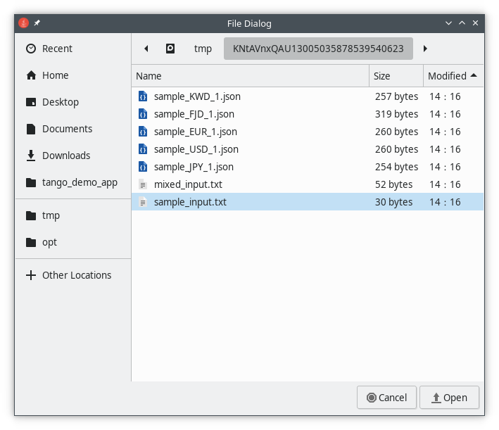
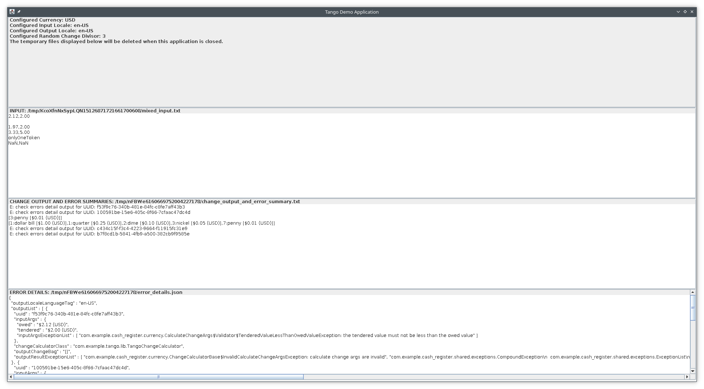
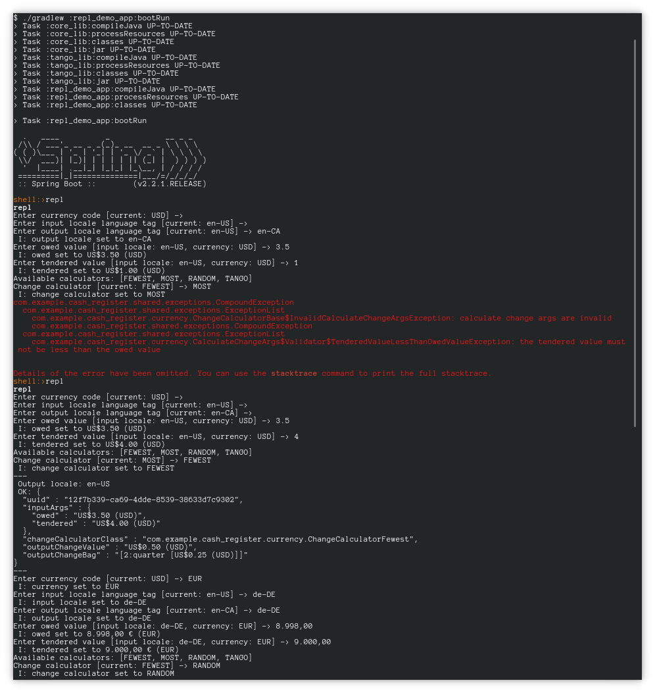

# Cash Register Implementation

Welcome to this cash register implementation.  This is a Java and Spring project; it is configured via Gradle.

The requirements for compiling and running this software are:

* a JDK, version 12.0.2
* an internet connection and access to the Maven Central artifact repository
* a graphical environment
  * the graphical environment is needed for the `tango_demo_app` application and a portion of the tests for that
  application.  The other modules in this project (and other tests in `tango_demo_app`) do not need a
  graphical environment.

Note, this application was developed and tested using the `Debian testing` Linux distribution, with the IntelliJ IDEA
Community Edition, version 2019.1.4 (version 2019.2.1 works and runs tests, but has a bug which causes test result 
display issues, see [JetBrains YouTrack, Issue IDEA-221159](https://youtrack.jetbrains.com/issue/IDEA-221159),
which seems to be the issue).

#### Modules overview

* **`core_lib`**: The core library of the application, which contains the classes needed to read, parse, represent,
validate, and calculate currency values and physical currency representations.  Also, several common classes and 
functionality reside here.  The core library can support any input locale and output locale which Java supports, 
and the change calculations currently support five different currencies.  Support for other currencies, for any currency
which Java supports via the 
[java.util.Currency](https://docs.oracle.com/en/java/javase/12/docs/api/java.base/java/util/Currency.html) class,
can be easily added via an appropriate configuration file per currency.  See below for additional information about the
supported currencies and why they were selected for support.

* **`tango_lib`**: This library contains the classes which support tango properties, input parsing, 
change calculation, and result output.  These classes are used to parse the expected sample input and to perform
both the "normal" (fewest number of pieces) and "random" change calculations, as specified by the original README.

* **`tango_demo_app`**: This module contains a simple graphical demo application.  This application allows the
user to select an input file, which will be processed and the results displayed.  This application supports both
the original README input file format and an additional JSON format.  These formats are detailed below.

* **`repl_demo_app`**:  This module contains a simple command-line REPL application, used to enter currency, input locale,
output locale, owed value, tendered value, choose a change calculator, and print results.  This was originally just a
sandbox application I was using for testing, but I saw the opportunity to learn more about Spring and took the time
to formalize the application a bit, for inclusion here.  It is useful for manual testing.

#### Building the application and running tests.

Run the root project `build` Gradle task for the project to build the projects and run the tests.  Optionally, run the 
`clean` Gradle task prior to the build.  For example, in a terminal from the root of the project:

* Linux and macOS:  `./gradlew clean build`
* Windows: `.\gradlew.bat clean build`

#### Configuration files and properties

There are two configuration files important to this project.  One contains global cash register properties;
the other is specific to tango functionality.  When present, the files can be found in the root of the
`resources` directory for their respective projects.

###### Cash Register (Global) Properties
The global file is named `cash_register.properties`.  It contains the following properties:

```properties
#####
# The default currency. This property is important for the tango workflow, which does not provide
#   currency information for input files. It is also used by the REPL application to provide a
#   default for currency.
#####
com.example.cash_register.currency.CashRegisterProperties.currency=USD

#####
# The default input locale, as an IETF BCP 47 language tag. This property is important for the tango
#   workflow, which does not provide input locale information for input files. It is also used by
#   the REPL application to provide a default for input locale.
#####
com.example.cash_register.currency.CashRegisterProperties.inputLocale.languageTag=en-US

#####
# The default output locale, as an IETF BCP 47 language tag. This is used by `.toString()` methods and
#   several other locations that output currency and/or number data.
#####
com.example.cash_register.currency.CashRegisterProperties.outputLocale.languageTag=en-US
```

###### Tango Properties
The tango specific file is named `tango.properties`.  It contains the following properties:

```properties
#####
# The random change divisor used by the tango change calculator.  For any change calculation
#   where the owed value is evenly divisible by this number, the combination of change will be randomly
#   chosen, rather than the normal combination of change (which returns the change in the fewest number of
#   physical pieces).
#####
com.example.tango.lib.TangoChangeCalculator.randomChangeDivisor=3
```

For the `bootRun` Gradle tasks of `tango_demo_app` and `repl_demo_app`, any of the properties defined within these
property files can also be overridden by a JVM system property of the same key/name.  For example:

```bash
./gradlew :tango_demo_app:bootRun -Dcom.example.cash_register.currency.CashRegisterProperties.currency=EUR
```

There also exist Spring `@Component` classes which provide helper methods for setting and getting configured 
properties.  For additional information, see the Java classes:

* `com.example.cash_register.currency.CashRegisterProperties`
* `com.example.tango.lib.TangoProperties`

```java
public class Example {
    @Autowired
    private CashRegisterProperties cashRegisterProperties;

    public void doSomething() {
        // Set output locale to `en-US`
        this.cashRegisterProperties.setOutputLocaleLanguageTag("en-US");

        // Set input locale to `en-US`.
        this.cashRegisterProperties.setInputLocaleLanguageTag("en-US");

        // Set currency to `USD`
        this.cashRegisterProperties.setCurrencyCode("USD");
    }
}
```

#### The supported currencies

This application supports five physical currencies for change calculation. These currencies were chosen to help
ensure support for edge cases, when processing currency. The supported currencies are:

  * **USD (United States Dollar)**: This currency was chosen primarily for familiarity (we live here); additionally, 
  it is the most commonly traded currency in the world, so it makes sense to add support.
  
  * **EUR (Euro)**: This currency was chosen as a simple alternative to the USD; it is the second most commonly
  traded currency in the world.
  
  * **JPY (Japanese Yen)**: While USD and EUR use 2 fractional digits, the JPY uses zero, so to ensure appropriate
  locale support, this is a good choice. 
  
  * **KWD (Kuwaiti Dinar)**: Similar to the reasoning used for JPY, the KWD uses 3 fractional digits, so this is also
   useful for locale support.
   
  * **FJD (Fijian Dollar)**: While the FJD is split into cents (FJD0.01), the smallest available physical currency
  is the 5-cent piece (FJD0.05). Thus, when validation of the currency values occurs, checks are made to ensure the 
  currency values in use are representable by the available physical currency.

The configuration for these physical currencies is found in the `core_lib` resources hierarchy, at:
* `com.example.cash_register.currency.physical_sets`

For example, this is the JSON configuration `USD.json`, which provides physical currency information for the USD:

```json
{
  "currency" : "USD",
  "currencyValues" : [ {
    "name" : "one hundred-dollar bill",
    "unitValue" : 10000
  }, {
    "name" : "fifty-dollar bill",
    "unitValue" : 5000
  }, {
    "name" : "twenty-dollar bill",
    "unitValue" : 2000
  }, {
    "name" : "ten-dollar bill",
    "unitValue" : 1000
  }, {
    "name" : "five-dollar bill",
    "unitValue" : 500
  }, {
    "name" : "dollar bill",
    "unitValue" : 100
  }, {
    "name" : "quarter",
    "unitValue" : 25
  }, {
    "name" : "dime",
    "unitValue" : 10
  }, {
    "name" : "nickel",
    "unitValue" : 5
  }, {
    "name" : "penny",
    "unitValue" : 1
  } ]
}
```

Other physical currencies can be added by adding similarly formatted JSON files to that resource directory 
(including recursively, as any subdirectories are also parsed).  The `currency` property is the ISO 4217 currency code, 
as supported by Java via the `Currency.getInstance(String currencyCode)` method.  The `currencyValues` property is a
list of compound properties consisting of the name and the unit value.  The name is an arbitrary identifier for the 
physical currency value, the unit value is the value of that piece of currency (as relates to the smallest
unit of the currency); in many instances, it can be thought of as the value of the currency without the decimal point.
For example, The USD penny `$0.01 (USD)` is represented by a unit value of `1`, while the USD dollar `$1.00 (USD)` is
represented by a unit value of `100`.

Note that, for several currencies of the world, the smallest available physical currency piece does not always match
up with the smallest unit value of the currency (see FJD, Fijian Dollar, above).

#### The supported locales

This application configures an input locale and an output locale, they default to "en-US" (english, United States).
Any IETF BCP 47 language tag supported by the Java method
[Locale.Builder.setLanguageTag(String)](https://docs.oracle.com/en/java/javase/12/docs/api/java.base/java/util/Locale.Builder.html#setLanguageTag(java.lang.String))
can be used for either the input locale or the output locale.

The input locale is used as a default to parse strings into `CurrencyValue` objects.  The output locale is used when
those values are written to output.

###### Note:

Both for this project and elsewhere, be aware when setting locales and parsing decimal strings; it can be easy to
neglect changing the decimal mark for the appropriate locale or to use a locale which displays a different number
of fractional digits than anticipated.

## The modules, detailed

## `core_lib`

The package `com.example.cash_register.currency` within the `core_lib` module contains the various chunks that make up
the calculate change workflow (and also several common implementations of these chunks).  The workflow chain goes in
the following order:

* **Input**: at its most abstract, this can be any object. Commonly, within the tests of this project, it will be a string
which refers to a file or a resource.  In other locations, it can be an already available `CalculateChangeArgs` object, 
which can be passed directly to the change calculator.

* **Input Translator**: if needed, this object can take the input and translate it to another form, which can then
be passed to an input parser.  If translation is not needed, then the input can be passed directly to an input parser.
  * The base class for input translators is `InputTranslatorBase<TInput, TTranslation>`, where `TInput` is the type of
 input and `TTranslation` is the translation of that input.
  * `InputStreamTranslatorBase` is an abstract subclass of `InputTranslatorBase` which translates into an input stream,
 since this is a common operation.
    * `InputStreamTranslatorFile`, `InputStreamTranslatorFilename`, `InputStreamTranslatorPath`, and 
    `InputStreamTranlatorResourceName` take various inputs related to files or resources and translate them to an
    input stream. 
  
* **Input Parser**: if needed, this object can take input and parse it into a list of `CalculateChangeArgs` objects,
which are then passed to the change calculator.
  * The base class for input parsers is `InputParserBase<TInput>`, where `TInput` is the type of input passed to this
 parser.
    * The class `CalculateChangeArgs.InputModelParser` is used to parse JSON input into calculate change args.
    
* **Change Calculator**: this object takes `CalculateChangeArgs` objects, calculates change, and returns 
`CalculateChangeResult` objects.
  * The base class for change calculators is `ChangeCalculatorBase`.  There are several common subclasses for
  `ChangeCalculatorBase`.
    * `ChangeCalculatorFewest` calculates the fewest possible number of physical currency pieces.
    * `ChangeCalculatorMost` calculates the most possible number of physical currency pieces (in practice, this means
    a change bag made up entirely of some count of the smallest available physical currency piece).
    * `ChangeCalculatorRandom` calculates a random number of physical currency pieces.
  
Currency itself is represented by the `CurrencyValue` and `PhysicalCurrency` classes.  `CurrencyValue` is a 
representation of a currency value, for example:  `$4.35 (USD)`.  A physical currency is a representation of a
physical piece of currency, for example: `quarter [$0.25 (USD)]` or `20 euro cent coin [0,20 € (EUR)]`.  Internally,
all calculations are ultimately based on the `BigInteger` class in Java.

The `PhysicalConverterBase` base class, and its subclasses are the core functionality which converts a `CurrencyValue`
value into physical currency.  They tend to match up with the change calculators, in that there are converters which
do `PhysicalConverterFewest`, `PhysicalConverterMost`, and `PhysicalConverterRandom`.

The `PhysicalSetConfig`, `PhysicalSetConfigParser`, and `PhysicalSetMap` classes are responsible for parsing the 
physical currency set JSON files, which configure the physical currencies available to the project.  The
`PhysicalSetMap` file also provides helper methods which can be use to determine if a currency or currency
value is supported by the project.

## `tango_lib`

The `tango_lib` module contains several classes, which extend `core_lib` classes to implement tango change calculation:

* `TangoChangeCalculator`: the tango change calculator, which will calculate the fewest possible number of physical
currency pieces, except in the case that the owed value is divisible by the random change divisor (defaults to 3,
see `Tango Properties` in the `Configuration files and properties` section).  When the owed value is divisible
by the random change divisor, the change calculation will return a random number of physical currency pieces.
* `TangoInputParser`: the tango input parser, which parses the input file format (as specified in the original README)
into calculate change args. This parser also deals with various exceptional situations, such as blank lines or lines
which are unable to be parsed.
* `TangoResultsWriter`: the tango results writer, which writes the results of tango change calculation to output.  This
writer writes two files.  One file is for the change output and error summaries.  The other file is for the error 
details.  When change output is available, the output from the Apache Commons Collections `TreeBag.toString()` method is
used, which provides a reasonable enough output.  Error summaries consist of an error line with a UUID which can be 
referenced in the error details output for additional information.

The `tango_lib` module also contains the `TangoProperties` class, which provides getters and setters for the tango
configuration properties described previously.

## `tango_demo_app`

To start the `tango_demo_app`, run the Gradle task `bootRun` for the module `tango_demo_app`.  Internally, this runs
the method `TangoDemoApplication.main(String...)`.  One way to run this application is:

* In a terminal, from the root of the project, run:
  * Linux and macOS: `./gradlew :tango_demo_app:bootRun`
  * Windows: `.\gradlew.bat :tango_demo_app:bootRun)`

The `tango_demo_app` module provides a simple GUI application which allows the user to select a file as input. The
selected file (except JSON files, see the next paragraph) will be sent to the tango change calculator, which
will calculate the appropriate result per line of the input file, and display the results:

* The configuration state of the application
* The input file (labeled `INPUT`)
* The change output and error summaries file (labeled `CHANGE OUTPUT AND ERROR SUMMARIES`)
* The error details file (labeled `ERROR DETAILS`).

The (temporary) file names for each section are also given, so that the files can be examined, copied, or saved 
for external use. However, be aware that the files will be deleted when the tango demo application is closed.

For demonstrative purposes, in addition to the tango input file format, this application also provides the
ability to load JSON file input.  If a file with a name which ends in `.json` is selected, then the JSON file input
parser will be executed, the change calculator will run, and the results will be displayed.  The output display GUI for
the JSON input is different from the tango output, in that it has only three sections in the output:  the configuration
for the application, the input file (labeled `INPUT`), and the output file (labeled `OUTPUT`).  Like the tango output, 
the temporary files created for display will be deleted when the application is closed.

The JSON input file structure will be described in a later section.

#### Screenshots:

###### Select file



###### Sample file output


###### Tango file output with errors



###### JSON file output


## `repl_demo_app`

The `repl_demo_app` module provides a simple command line application (based on Spring Shell), which allows the user
to manually input data and run a single change calculation with any of the available currencies, locales, or
calculators.  The application then loops and will repeat indefinitely unless manually stopped.

To start the application, run the Gradle task `bootRun` in the `repl_demo_app` module.  Internally, this runs
the method `ReplApplication.main(String...)`.  One way to run this task is:

* In a terminal, from the root of the project:
   * Linux and macOS: `./gradlew :repl_demo_app:bootRun`
   * Windows: `.\gradlew.bat :repl_demo_app:bootRun`

This will result in a Spring Shell prompt, which will look like `shell:>`.  Enter `repl` to start the REPL application.

There are two ways to stop this application:

1. Enter the string `/exit` at any of the prompts. This will return control to the
Spring Shell itself.  At that point, the Spring Shell command `exit` can be entered, and the
Spring Shell application will exit. Note that from the Spring Shell prompt, it is also possible to reenter the REPL
demo application by entering the string `repl`, which will restart the prompt loop, with the previous
REPL state intact (i.e., selected currency, input locale, output locale, and calculator).
2. Enter the key combination Control-C.  This will break out of the Spring Shell application and return control
to the operating system command shell.

The currency, input locale, and output locale properties of the REPL application choose defaults from the
configuration files for the application (calculator defaults to `FEWEST`). The default values can be accepted by 
simply inputting `Enter` on a blank line.  These values can also be changed to any of the supported values.  Once
a new value is set, that value will be the default until it is changed again, or the application exits.

The owed and tendered input to the REPL application do not default to any value and a value must be entered.  Entering 
a blank line for either of these values will result in the prompt being displayed again in a loop until a value is
entered.

#### Screenshots




#### JSON input files

The input file format provided in the original README is supported via classes in the `tango_lib` module, as described
in a previous section.  In addition to that file format, an additional JSON format is supported, which will be 
described here.

During the planning stages of this project, one of the questions in the "Things To Consider" questions was: "What might
happen if sales closes a new client in France?"  This led to thought about the need to support multiple currencies and
locales within the project. The first possible impediment recognized was that the existing input file format
tokenized the owed and tendered values with a comma, which can be used as a decimal mark in other locales, including
France. From there, the requirement of a structured data input was embedded in the project design.  From 
there, grew the JSON file input format.  Within the JSON file input format, the currency and the input locale are
included and used from the JSON itself.

The JSON file input format is straightforward.  It consists of the following properties:

  * `currency`: The ISO 4217 currency code representing the currency, for example, `"EUR"`.
  * `inputLocale`: An IETF BCP 47 language tag representing the input locale, for example, `"fr-FR"`.
  * `owedAndTenderedList`: A list of one or more owed and tendered entries for which change will be calculated.

For example:

```json
{
  "currency" : "EUR",
  "inputLocale" : "fr-FR",
  "owedAndTenderedList" : [ {
    "owed" : "3,00",
    "tendered" : "5,50"
  }, {
    "owed" : "3,50",
    "tendered" : "1,00"
  }, {
    "owed" : "3,50",
    "tendered" : "5,00"
  } ]
}
```

#### JSON output files

There also exists a JSON output file format.  This file format is the normal output format for the JSON input file, and
is also used by the tango workflow process for error details output.  This file format consists of:
 
* The output locale used to write the JSON output, for reference
* An output list of calculate change results, which, in turn, are made up of:
  * A UUID for the result, for reference
  * The input args used to generate the result
  * The output bag of physical currency representing the change, or empty, if no change is available.
  * The list of exceptions associated with this result, if available. Generally, these will be validation exceptions
  describing issues with the change calculation operation.
  
For example:

```json
{
  "outputLocaleLanguageTag" : "en-US",
  "outputList" : [ {
    "uuid" : "72b3bb38-ba31-421c-b563-2e0ee4ddf87a",
    "inputArgs" : {
      "owed" : "$3.00 (USD)",
      "tendered" : "$5.50 (USD)"
    },
    "outputChangeBag" : "[2:dollar bill [$1.00 (USD)],2:quarter [$0.25 (USD)]]"
  }, {
    "uuid" : "96db2011-e1b1-426f-aae5-279bcd96951b",
    "inputArgs" : {
      "owed" : "$3.50 (USD)",
      "tendered" : "$1.00 (USD)",
      "inputArgsExceptionList" : [ "com.example.cash_register.currency.CalculateChangeArgs$Validator$TenderedValueLessThanOwedValueException: the tendered value must not be less than the owed value" ]
    },
    "outputChangeBag" : "[]",
    "outputResultExceptionList" : [ "com.example.cash_register.currency.ChangeCalculatorBase$InvalidCalculateChangeArgsException: calculate change args are invalid", "com.example.cash_register.shared.exceptions.CompoundException\n  com.example.cash_register.shared.exceptions.ExceptionList\n    com.example.cash_register.currency.CalculateChangeArgs$Validator$TenderedValueLessThanOwedValueException: the tendered value must not be less than the owed value\n" ]
  }, {
    "uuid" : "d1dcaecb-38c0-4d93-aa52-c0a1beda17ad",
    "inputArgs" : {
      "owed" : "$2.50 (USD)",
      "tendered" : "$5.00 (USD)"
    },
    "outputChangeBag" : "[2:dollar bill [$1.00 (USD)],2:quarter [$0.25 (USD)]]"
  } ]
}
```

#### Javadoc output

An archive containing the Javadoc output for this project is available at:

* `artifacts/javadoc.tar.xz`

The documents covers the main Java files, and some of the utility and helper methods used by test files.  Where
not documented via Javadoc, test files tend to have the `@Test` methods named after the method they are testing and 
(if needed) the exception they are expecting to receive.

#### Test coverage output

This project uses the JaCoCo library for test coverage.  This project has 100% test coverage with one exception in the 
`repl_demo_app` module, in which the `ReplApplication.main(String...)` method responsible for starting the Spring Boot
application is uncovered, due to difficulty with starting Spring Shell in a test environment.  However, simply starting
the `repl_demo_app` application via the `:repl_demo_app:bootRun` Gradle task runs this code, so it is known to work.
An archive containing the JaCoCo output for this project is available at:

* `artifacts/jacoco_reports.tar.xz`
